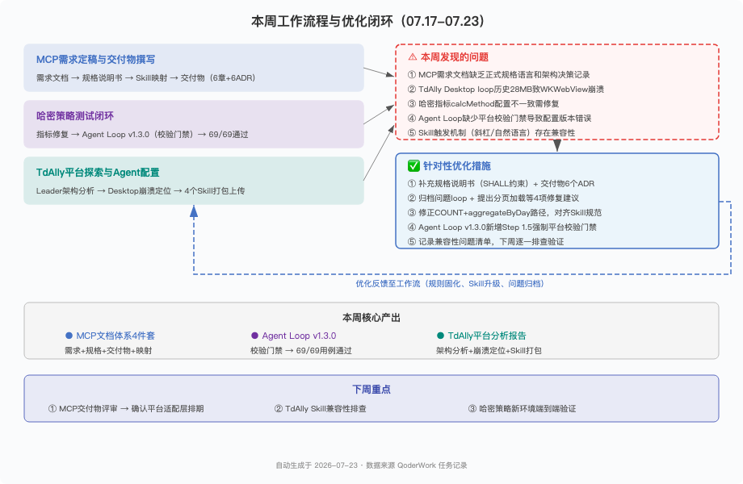

# 26年：07.17-07.23

一、本周进展

🚀 MCP文档体系完成四件套：在需求文档基础上，补充规格说明书（SHALL约束语言版）、交付物文档（6项优先级能力共52个工具接口设计）和20个Skill与MCP工具的映射分析，记录6项架构决策。文档体系从"分析报告"转为可直接交付评审的正式需求包。

💡 三峡策略测试闭环 + 哈密指标修复：三峡完成DF_PRE_CONC_001 V2+贷前策略69条用例全流程闭环，过程中发现Agent Loop缺少平台校验门禁导致配置版本错误，升级至v1.3.0新增Step 1.5强制校验。哈密修复day30_p_date_cnt指标calcMethod配置（ACTIVE_DAY_COUNT → COUNT+aggregateByDay）。

🔥 TdAlly平台问题定位与架构分析：定位Desktop UI崩溃根因——loop会话历史过大（约28MB）致WKWebView渲染崩溃，归档后恢复，提出分页加载等4项修复建议。同期梳理tiance-loop-leader三子agent编排架构，完成4个skill打包上传和Agent配置。

二、当前判断

三峡策略测试闭环验证了Agent Loop框架的基本可用性，但执行暴露的盲区（配置版本错误）说明纯评审阶段难以覆盖所有问题，需持续积累执行反馈驱动规则迭代。TdAlly平台崩溃暴露了会话历史管理的健壮性短板，分页加载等修复建议需尽快落地。

三、当前关注点

● Agent Loop校验门禁上线后需更多执行样本验证其覆盖率和误拦截率
● TdAlly skill触发兼容性尚未排查，可能影响多agent协作流程的可用性
● 三峡和哈密策略在新环境的端到端验证未展开，存在环境差异导致的回归风险

四、下周计划

● 排查TdAlly skill触发兼容性，验证多agent协作流程
● 三峡和哈密策略在新环境完成端到端验证
● 积累更多策略测试执行样本，迭代Agent Loop校验规则
