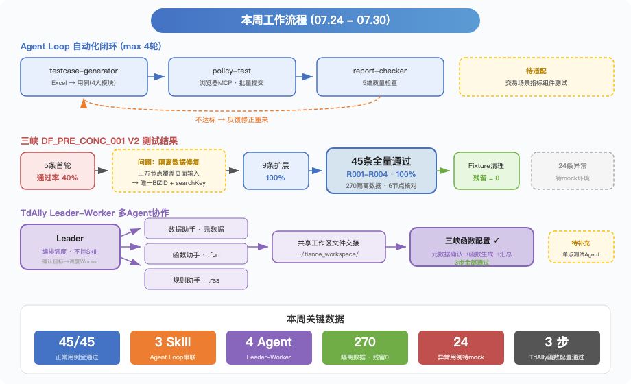

# 26年：07.24-07.30

本周策略测试和TdAlly两条主线均有实质推进。三峡保前集中度策略在Codex环境中完成45条正常用例全通过，Agent Loop三Skill串联的自动化闭环已在实战中得到验证；TdAlly Leader-Worker四Agent协作架构跑通了三峡函数配置的最小闭环。

## 一、本周进展

🚀 **三峡保前集中度策略测试45/45全通过**：在Codex环境中对三峡担保保前集中度判断策略（DF_PRE_CONC_001 V2，bizType=1，orgCode=sxdb）执行全量正常用例测试。经历5条→9条→45条三轮递进，首轮5条通过率仅40%（三方数据节点返回值覆盖页面输入导致断言不一致），修复隔离数据方案后复测100%通过。45条用例覆盖R001-R004四条规则（命中分布10/8/9/4），6个三方数据节点（单户/关联户集中度实时+离线、市级区域集中度实时+离线）逐条核对，270条隔离数据测试后全量清理、6张相关表残留均为0。执行过程中同步优化Skill：批量模板兼容处理（修复必填字段、枚举格式、S_S_BIZID导入报错）、耗时瓶颈脚本化（隔离Fixture创建/回查/清理、规则级证据比对、报告公式和渲染检查），24条异常用例因需真实mock环境暂未执行。

💡 **Agent Loop三Skill串联闭环验证**：策略测试的Agent Loop自动化闭环在三峡保前策略上得到实战验证——tiance-testcase-generator从Excel生成用例（规则命中/未命中/边界值、函数级、决策流分支、预警等级四大模块），tiance-policy-test通过浏览器MCP批量提交（每批≤5条、500ms间隔防超时），tiance-report-checker从判定一致性、实际结果质量、语义重复、数据完整性、系统回查比对五个维度做质量检查，不达标则反馈修正重来，最多循环4轮。当前测试只适配不含指标组件的信贷场景，交易场景适配和函数/规则单点测试Agent仍需补充。

🔥 **TdAlly Leader-Worker四Agent协作跑通最小闭环**：配置了4个智能体组成策略配置流水线——Leader（天策配置编排助手）不挂Skill只负责调度，数据助手/函数配置助手/规则配置助手各挂一个Skill，通过共享工作区~/tiance_workspace/按文件交接数据。三峡项目函数配置任务已通过3步流程验证（元数据确认→函数生成→汇总），Leader自动解析任务目标并确认Excel路径、执行流程、目标平台和成功标准后调度Worker执行。待优化方向：加入函数/规则单点测试Agent来校验配置质量，形成更完整的策略配置工作流。

## 二、当前判断

策略测试Skill的通用化能力在三峡保前策略上得到第二轮验证：从保后检查（249条/96%）到保前集中度（45条/100%），三层架构（通用引擎+运行时API发现+策略配置文件）的可复用性基本成立。Agent Loop三Skill串联和TdAlly Leader-Worker协作均已跑通最小闭环，核心卡点从"能不能跑通"转向两个方向：一是24条异常用例需要真实mock环境（普通造数无法模拟超时、接口异常等故障），二是当前测试只适配信贷场景，交易场景的指标组件测试尚未覆盖。

## 三、当前关注点

- 24条异常用例的mock环境搭建，需在平台侧配置mock服务并验证readiness探针
- 策略测试适配交易场景，加入指标组件测试能力
- TdAlly补充函数/规则单点测试Agent，完善策略配置工作流闭环

## 四、下周计划

- 推进24条异常用例的mock环境配置，力争补齐异常测试覆盖
- 研究指标组件测试方案，为交易场景策略测试做技术储备
- TdAlly加入单点测试Agent，验证函数/规则配置质量的自动化校验
