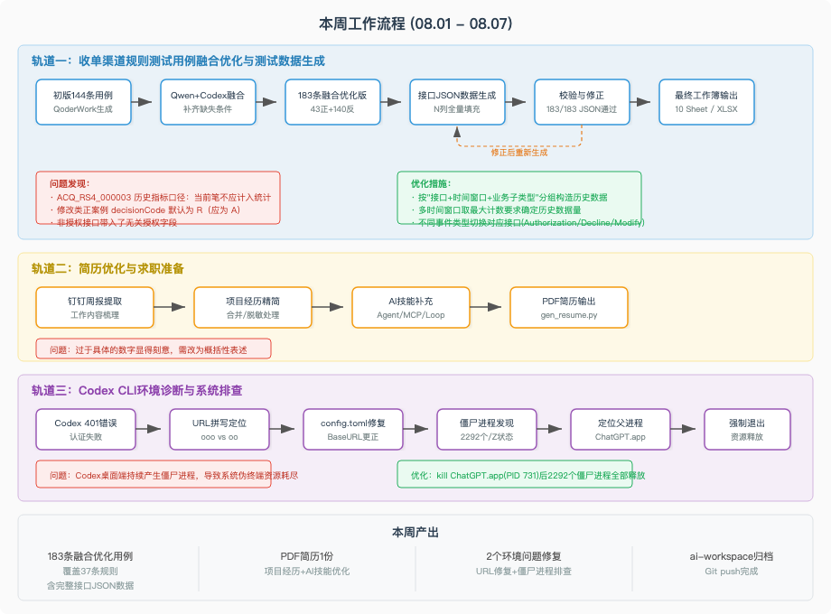

# 26年：08.01-08.07

本周工作围绕收单渠道规则测试用例的多版本融合与测试数据生成展开，同时处理了开发环境排查和个人事务。测试用例从初版144条扩展到融合优化版183条，并完成了全量接口JSON测试数据的构造与校验。

## 一、本周进展

🚀 **收单渠道规则测试用例融合优化与测试数据生成**：以Qwen版业务数据构造为基础，补齐Codex版覆盖的缺失条件，完成Acq Merchant Abnormal Business规则集的融合优化版用例。37条规则共输出183条测试用例（43正案例+140反案例），重写ACQ_RS4_000003、000004、000007、000022的关联指标和OR逻辑，修正当前笔是否计入、比例分母和共享指标口径，清除VALID_VALUE/OTHER_VALUE等占位内容。在此基础上完成全量N列测试数据生成：183条JSON全部通过解析校验，164条包含历史数据（最大批次600条），19条无需历史数据。过程中修正了ACQ_RS4_000003的历史指标口径（当前笔不计入统计），按"接口+时间窗口+业务子类型"分组构造历史数据，确保多时间窗口场景下指标累计值可达。

💡 **个人简历优化与求职信息整理**：从历史钉钉周报和对话记录中提取工作内容，迭代优化简历项目经历描述。保后检查与保前集中度两个策略的描述做了精简调整，项目经历合并为智慧水务系统一段，AI技能部分补充了多Agent协作、MCP协议、Prompt工程、Agent Loop编排等能力项。同步整理了求职基本信息和薪资期望。

🔥 **Codex CLI环境诊断与系统资源排查**：排查Codex CLI 401认证错误，定位为API BaseURL拼写错误（ooworkplan→oooworkplan），修复后认证恢复正常。进一步发现Codex桌面端产生大量僵尸进程（约2292个）导致系统伪终端资源耗尽，定位到ChatGPT.app为僵尸进程父进程后强制退出释放资源。

## 二、当前判断

收单渠道测试用例经历了"初版生成→多版本融合→测试数据构造"三轮迭代，从144条扩展到183条并附带完整的接口JSON数据，用例质量和可执行性有了明显提升。过程中暴露了几个共性问题——历史指标是否计入当前笔的口径判断、多时间窗口下历史数据量的确定、不同事件类型对应不同接口地址——这些经验可以沉淀到risk-rule-testcase skill中，提升后续用例生成的准确度。

## 三、当前关注点

- 收单渠道融合版用例的实际执行验证，需对接天策平台提交测试
- 将历史指标口径、接口字段映射等经验沉淀到skill中
- 持续关注Codex桌面端的资源占用情况

## 四、下周计划

- 将收单渠道测试用例提交天策平台执行，收集测试结果
- 整理测试数据生成器的通用逻辑，补充到risk-rule-testcase skill
- 继续完善简历，针对不同岗位方向做差异化调整
