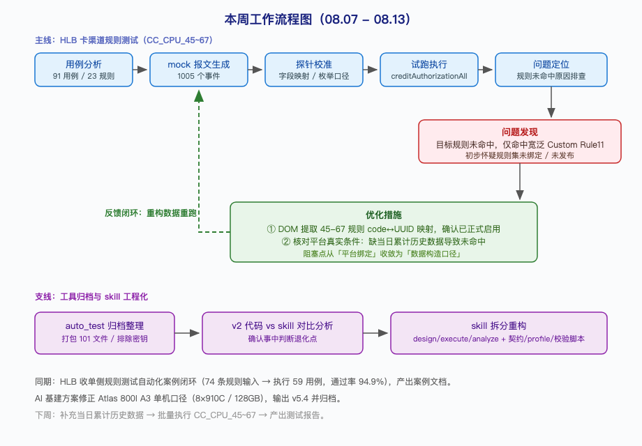

# 26年：08.07-08.13

本周工作围绕 HLB 项目规则测试自动化展开：收单侧初步跑通「规则描述输入 → 用例生成 → 执行验证」完整闭环并沉淀为可复用的 skill 体系；卡渠道 CC_CPU_45~67 沿同一路径推进执行准备，将目标规则未命中的原因从「平台绑定问题」收敛到「数据构造口径问题」。

## 一、本周进展

🚀 **HLB 卡渠道 CC_CPU_45~67 测试准备基本完成**：分析了用例工作簿中 23 条规则的 91 条用例，生成全部 mock 报文（1005 个事件），并通过探针实测校准了字段映射与枚举口径。执行中发现目标规则未命中，本周定位原因为探针缺少当日累计历史数据（如 CC_CPU_60 要求当日累计金额达标），同时提取了 45-67 规则的编码与 UUID 映射，确认规则集已正式启用。

🔥 **收单侧规则测试自动化案例闭环与 skill 优化**：以 74 条规则的详细描述为输入，跑通用例生成与执行验证全流程（累计执行 59 条用例，通过率 94.9%），并沉淀为案例文档。成果同步落地到 skill 重构：单体 risk-rule-testcase 拆分为 design / execute / analyze 三个子 skill，15 条核心规范整理为 test-data-contract.md，HLB 项目配置独立为 acquiring-hlb-profile.md 支持多项目复用，新增 validate-test-data.js 自动校验 8 类数据质量问题。

💡 **旧版测试工具归档与对比分析**：整理打包 auto_test 归档目录（排除密钥与旧副本），并与 risk-rule-testcase skill 逐环节对比，确认 v2 代码基于平台元数据判断「事中」语义比 skill 的文本猜测更可靠，明确了 skill 作为「文档交付」分支的定位与已知退化点。

💡 **AI 基建方案修正**：更正华为 Atlas 800I A3 单机配置为官方口径 8×910C（单卡 128GB），确认非信创路线 H20 配置的显存瓶颈逻辑，输出 v5.4 版本并归档。

## 二、当前判断

规则测试自动化的整体链路已在收单侧得到验证，并形成可复用的 skill 体系；卡渠道测试正沿同一路径推进，准备工作基本就绪，当前阻塞点是当日累计类指标的数据构造口径，批量执行和报告产出尚未完成。skill 与旧版代码在事中判断口径上的差距是已知的实质性退化点，后续需要补齐。

## 三、当前关注点

- CC_CPU_45~67 的 mock 数据需补充当日累计历史后重跑，验证目标规则命中
- 6 个失败用例依赖平台侧实时指标定义（统计维度/过滤条件）的人工确认
- 日均分母双口径（/90天、/活跃天数）与低风险商户名单等平台侧依赖项的落地

## 四、下周计划

- 完成 CC_CPU_45~67 批量执行并产出测试报告
- 跟进平台指标配置确认，修复剩余失败用例
- 参考 v2 的元数据方式，推进 skill 事中判断口径的改进
