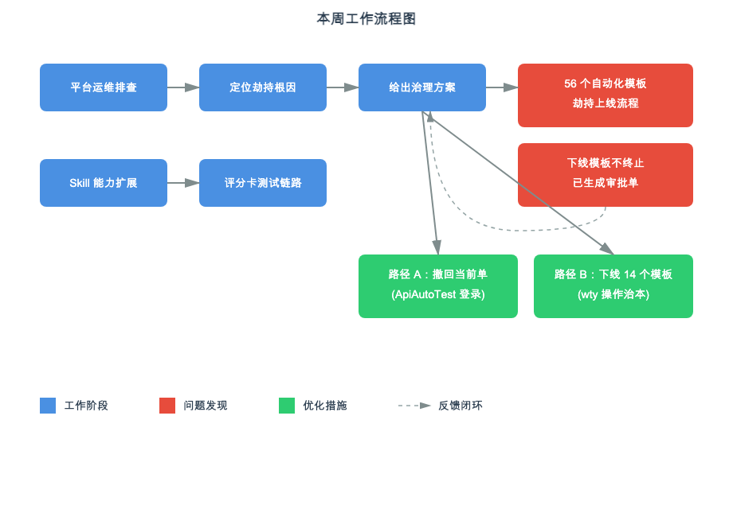

# 26年：09.11-09.17

本周工作围绕天策平台运维排查与策略测试 Skill 能力扩展展开：定位了自动化审批模板劫持规则集上线的根因并给出两条治理路径；策略测试 Skill 新增评分卡/.pls 类策略测试链路，完成解码器与参考文档配套。

## 一、本周进展

🔥 **天策平台自动化审批模板劫持问题排查**：定位到 ApiAutoTest 遗留的 56 个自动化审批模板（其中 10 个规则集 + 4 个策略模板仍"已上线"）持续劫持规则集/策略上线流程，将上线变为"待审核"垃圾单；实证下线/删除模板不会终止已生成的审批单，给出路径 A（用 ApiAutoTest 撤回当前卡住的单）+ 路径 B（用 wty 下线 14 个模板治本）的组合治理方案。

💡 **策略测试 Skill 评分卡能力扩展**：tiance-policy-test skill 新增评分卡/.pls 类策略测试链路，配套 decode_pls.py 解码器与 scorecard-pls-testing.md 参考文档（八节齐全），支持从 .pls 解码取身份与分箱 → 按分箱边界+缺省设计最小充分用例 → 浏览器 fetch 真实执行 → C_F_APPLYSCORE 评分证据提取 → 五态报告全链路。

## 二、当前判断

平台审批模板劫持问题的根因已定位清楚，治理方案（撤回 + 下线）可行但需 ApiAutoTest 登录配合；策略测试 Skill 已具备评分卡测试能力，待平台上后可跑实测。

## 三、当前关注点

- 路径 A 执行：需 ApiAutoTest 登录撤回当前卡住的 RISK_TREND_RULESET_001 上线单
- 路径 B 执行：用 wty 下线 14 个自动化模板防止后续劫持
- 评分卡策略上线后跑实测验证

## 四、下周计划

- 配合完成 ApiAutoTest 登录与审批单撤回
- 执行 14 个自动化模板下线操作
- 评分卡策略上线后跑边界样本实测
