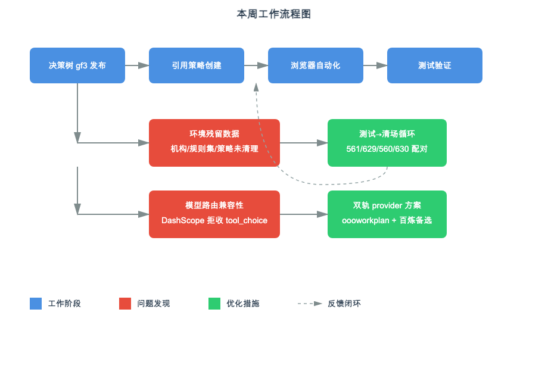

# 26年：09.18-09.24

本周工作围绕盾测平台测试任务调试和策略测试技能验证展开：系统性梳理盾测测试任务跑通流程（schedule → playbook → yml → API 步），排查 561/629/560/630 任务的环境残留数据和失败原因；通过创建决策树和引用策略验证策略测试技能的端到端能力；优化 Codex 环境配置，解决 DashScope auto 模型路由兼容性问题（拒收 tool_choice 参数），建立 oooworkplan + 百炼 Token Plan 双轨方案。

## 一、本周进展

🚀 **盾测平台测试任务调试：**
- 系统性梳理盾测测试任务跑通流程（schedule → playbook → yml → API 步），建立"测试→清场"交替循环机制（561/629 测试 + 560/630 清场配对）。
- 排查 561/629/560/630 任务的环境残留数据，定位机构创建（trade_graph_org_level2/3、ORG_LEVEL2/3）、规则集下线、审批锁死（online_wait_initial_audit）等关键问题。
- 推进英文环境测试闭环，验证 bridgeApi 跨域可达性问题（机构接口不可达，需手动验证 4 个机构残留）。

💡 **策略测试技能完善：决策工具类策略测试能力：**
- 完善对含决策工具的策略的测试能力，通过创建决策树 gf3（D_TREE 模式）并发布上线，创建引用策略 dt_tree_ref_test（流模式，贷前业务）作为验证案例。
- 使用浏览器自动化完成策略创建表单填写和流程编排，验证从决策树发布到策略创建到测试执行的全链路可行性，补齐决策工具类策略的测试覆盖。

🔥 **Codex 环境配置优化：**
- 配置阿里百炼 Token Plan provider（dashscope_tp_1，qwen3.8-max 模型），修复 auto 模型路由问题（DashScope 拒收 tool_choice 参数导致 400 错误），优化模型目录配置删除 auto 条目。
- 后续根据实际使用效果回滚到 oooworkplan provider（gpt-6-astra），保留百炼配置作为备选，建立双轨 provider 方案。

## 二、当前判断

策略测试技能开发完成决策树发布和引用策略创建的端到端验证，浏览器自动化流程基本跑通；盾测平台测试任务流程已系统性梳理，环境清理和任务调试机制建立；Codex 环境配置经过多轮调试，确定 oooworkplan 作为主 provider、百炼 Token Plan 作为备选的双轨方案。仍需改进的是盾测英文环境的机构残留验证（bridgeApi 跨域不可达）和策略测试技能的端到端自动化闭环。

## 三、当前关注点

- 盾测英文环境 4 个机构残留验证（trade_graph_org_level2/3、ORG_LEVEL2/3），确认环境干净后跑通 629 任务
- 策略测试技能端到端自动化：从决策树发布到策略创建到测试执行的全链路自动化
- Codex 环境稳定性监控：跟踪 oooworkplan 和百炼 Token Plan 的实际使用效果和成本

## 四、下周计划

- 完成盾测英文环境测试闭环：验证机构残留 → 跑通 629 → 紧跟 630 清场
- 推进策略测试技能自动化：补齐浏览器自动化表单填写和流程编排的边界场景
- 优化 Codex 配置管理：建立 provider 切换脚本和环境配置文档，降低后续调试成本
